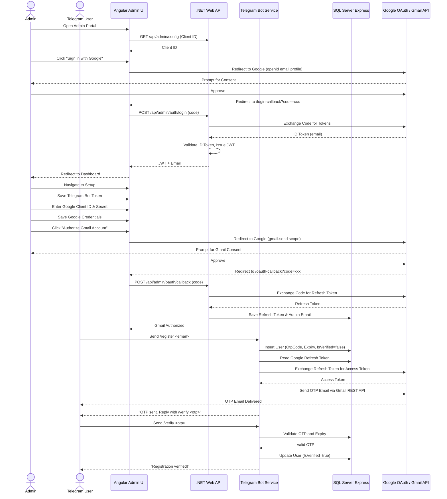

# RemoteAssistant

A multi-project .NET 10 and Angular 18 application for job scheduling and remote system assistance, with Telegram bot user registration and Gmail OAuth-based email sending.

---

## Architecture



---

## Solution Structure

| Project | Description |
|---------|-------------|
| `RemoteAssistant.Core` | Shared models and EF Core DbContext |
| `RemoteAssistant.WebApi` | REST API: auth, config, OAuth callbacks, user listing |
| `RemoteAssistant.Worker` | Background service: Telegram bot polling + Gmail sender |
| `remote-assistant-admin-ui` | Angular 18 SPA — glassmorphic dark theme |

---

## Database Schema

### `Users` Table

| Column | Type | Nullable | Description |
|--------|------|----------|-------------|
| `TelegramId` | `bigint` | NOT NULL (PK) | Unique Telegram user identifier |
| `Email` | `nvarchar(255)` | NOT NULL | Email provided during registration |
| `IsVerified` | `bit` | NOT NULL | `0` = Pending, `1` = Verified |
| `OtpCode` | `nvarchar(10)` | NULL | Active 6-digit OTP |
| `OtpExpiry` | `datetime2` | NULL | OTP expiration (created + 5 min) |
| `CreatedAt` | `datetime2` | NOT NULL | Registration timestamp |
| `VerifiedAt` | `datetime2` | NULL | Verification timestamp |

### `SystemSettings` Table

| Column | Type | Nullable | Description |
|--------|------|----------|-------------|
| `Key` | `nvarchar(100)` | NOT NULL (PK) | Setting key (e.g. `GoogleClientId`) |
| `Value` | `nvarchar(max)` | NULL | Setting value |
| `UpdatedAt` | `datetime2` | NOT NULL | Last modified timestamp |

---

## Prerequisites

- **.NET 10 SDK**
- **Node.js** v18+ & npm
- **SQL Server Express** (local)
- **Google Cloud Console** project with OAuth 2.0 credentials

---

## Google Cloud Console Setup

1. Go to the [Google Cloud Console](https://console.cloud.google.com/)
2. Create a project → **APIs & Services > Credentials**
3. Configure the **OAuth Consent Screen** (External) with scopes:
   - `openid` / `email` / `profile` (for login)
   - `https://www.googleapis.com/auth/gmail.send` (for sending OTP emails)
4. Create **OAuth Client ID** → Web Application
5. Add **Authorized redirect URIs**:
   - `http://localhost:4200/login-callback`
   - `http://localhost:4200/oauth-callback`
6. Save to get your **Client ID** and **Client Secret**

---

## Telegram Bot Setup

1. Open Telegram → search **@BotFather**
2. Send `/newbot` and follow prompts
3. Save the HTTP API **Bot Token**

---

## Running the Application

### 1. Start the Web API
```bash
dotnet run --project RemoteAssistant.WebApi
```
Creates the database schema on first startup.

### 2. Start the Worker Service
```bash
dotnet run --project RemoteAssistant.Worker
```
The worker waits until the Telegram Bot Token is configured before polling.

### 3. Start the Angular Admin UI
```bash
cd remote-assistant-admin-ui
npm install
npm run start
```

### 4. Configuration Workflow

1. Open **`http://localhost:4200`** — you'll be redirected to the **login page**
2. Click **Sign in with Google** to authenticate with your admin Google account
3. After login, you're taken to the **Dashboard**
4. Click **⚙ Settings Panel** → go to the Setup page
5. Enter your **Telegram Bot Token** and click **Save Bot Token**
6. Enter your Google **Client ID** and **Client Secret**, click **Save Credentials**
7. Click **🔑 Authorize Gmail Account** → consent via Google → redirected back
8. Gmail service shows active status — setup complete

> Optional: Restrict access to a specific Google account by setting `"Admin:AllowedEmail": "admin@example.com"` in `appsettings.json`.

---

## API Endpoints

| Method | Endpoint | Auth | Description |
|--------|----------|------|-------------|
| `POST` | `/api/admin/auth/login` | No | Exchange Google code → JWT |
| `GET` | `/api/admin/auth/status` | Yes | Current user email |
| `POST` | `/api/admin/auth/logout` | No | Logout (client-side) |
| `GET` | `/api/admin/config` | No | Configuration status |
| `POST` | `/api/admin/config/telegram` | Yes | Save Telegram Bot Token |
| `POST` | `/api/admin/config/google` | Yes | Save Google OAuth credentials |
| `POST` | `/api/admin/oauth/callback` | No | Gmail OAuth code exchange |
| `GET` | `/api/admin/users` | Yes | List registered users |

---

## Verification Flow

1. Open Telegram → find your bot → send `/start`
2. Send `/register your-email@example.com`
3. Check inbox for `RemoteAssistant Registration OTP`
4. Reply `/verify <otp-code>` in Telegram
5. Bot confirms verification — user appears on the Dashboard

---

## Configuration Keys (appsettings.json)

```jsonc
{
  "Google": {
    "ClientId": "",     // Optional fallback if not in DB
    "ClientSecret": ""  // Optional fallback if not in DB
  },
  "Admin": {
    "AllowedEmail": ""  // Optional: restrict login to one email
  },
  "Jwt": {
    "Key": "",          // Custom signing key (min 32 chars)
    "Issuer": "RemoteAssistant",
    "Audience": "RemoteAssistant-AdminUI"
  },
  "ConnectionStrings": {
    "DefaultConnection": "Server=localhost\\SQLEXPRESS;Database=SchedulerTelegramDb;Trusted_Connection=True;TrustServerCertificate=True;"
  }
}
```
