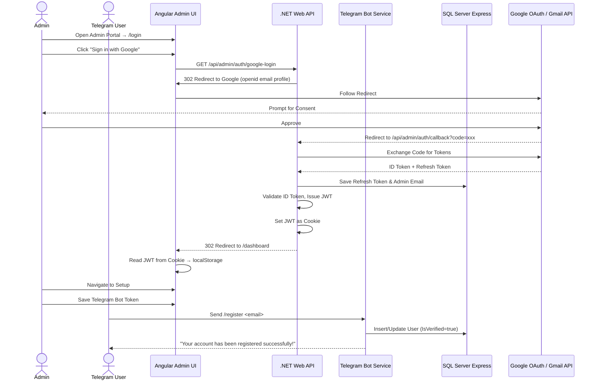

# RemoteAssistant

A multi-project .NET 10 and Angular 18 application with Google OAuth admin login and Telegram bot user registration.

---

## Architecture



---

## Solution Structure

| Project | Description |
|---------|-------------|
| `RemoteAssistant.Core` | Shared models and EF Core DbContext |
| `RemoteAssistant.WebApi` | REST API: auth, config, OAuth callbacks, user listing |
| `RemoteAssistant.Worker` | Background service: Telegram bot polling for user registration |
| `remote-assistant-admin-ui` | Angular 18 SPA — glassmorphic dark theme |

---

## Database Schema

### `Users` Table

| Column | Type | Nullable | Description |
|--------|------|----------|-------------|
| `TelegramId` | `bigint` | NOT NULL (PK) | Unique Telegram user identifier |
| `Email` | `nvarchar(255)` | NOT NULL | Email provided during registration |
| `IsVerified` | `bit` | NOT NULL | `0` = Pending, `1` = Verified |
| `OtpCode` | `nvarchar(10)` | NULL | Active 6-digit OTP |
| `OtpExpiry` | `datetime2` | NULL | OTP expiration (created + 5 min) |
| `CreatedAt` | `datetime2` | NOT NULL | Registration timestamp |
| `VerifiedAt` | `datetime2` | NULL | Verification timestamp |

### `SystemSettings` Table

| Column | Type | Nullable | Description |
|--------|------|----------|-------------|
| `Key` | `nvarchar(100)` | NOT NULL (PK) | Setting key (e.g. `GoogleClientId`) |
| `Value` | `nvarchar(max)` | NULL | Setting value |
| `UpdatedAt` | `datetime2` | NOT NULL | Last modified timestamp |

---

## Prerequisites

- **.NET 10 SDK**
- **Node.js** v18+ & npm
- **SQL Server Express** (local)
- **Google Cloud Console** project with OAuth 2.0 credentials

---

## Google Cloud Console Setup

1. Go to the [Google Cloud Console](https://console.cloud.google.com/)
2. Create a project → **APIs & Services > Credentials**
3. Configure the **OAuth Consent Screen** (External) with scopes:
   - `openid` / `email` / `profile`
4. Create **OAuth Client ID** → Web Application
5. Under **Authorized redirect URIs**, add:
   ```
   http://localhost:5000/api/admin/auth/callback
   ```
6. Save to get your **Client ID** and **Client Secret**

---

## Telegram Bot Setup

1. Open Telegram → search **@BotFather**
2. Send `/newbot` and follow prompts
3. Save the HTTP API **Bot Token**

---

## Running the Application

### 1. Start the Web API
```bash
dotnet run --project RemoteAssistant.WebApi
```
Starts on `http://localhost:5000`. Creates the database schema on first startup.

### 2. Start the Worker Service
```bash
dotnet run --project RemoteAssistant.Worker
```
The worker waits until the Telegram Bot Token is configured before polling.

### 3. Start the Angular Admin UI
```bash
cd remote-assistant-admin-ui
npm install
npm run start
```
Starts on `http://localhost:4200`.

### 4. Configuration Workflow

> **First run**: Configure your Google Client ID and Client Secret in `appsettings.json` (under the `"Google"` section) or via the login page form. Without these, OAuth will not work.

1. Open **`http://localhost:4200`** — you'll be redirected to the **login page**
2. If credentials are not yet configured, enter your **Client ID** and **Client Secret** and click **Save Credentials**
3. Click **Sign in with Google** — the server redirects you to Google. A single consent screen covers both sign-in and Gmail access.
4. After login, you're taken to the **Dashboard**. Gmail is already authorized.
5. Click **⚙ Settings Panel** → go to the Setup page
6. Enter your **Telegram Bot Token** and click **Save Bot Token** — setup complete

> Optional: Restrict access to a specific Google account by setting `"Admin:AllowedEmail": "admin@example.com"` in `appsettings.json`.

---

## API Endpoints

| Method | Endpoint | Auth | Description |
|--------|----------|------|-------------|
| `GET` | `/api/admin/auth/google-login` | No | Redirect to Google OAuth (openid email profile) |
| `GET` | `/api/admin/auth/callback` | No | Google OAuth callback — exchanges code, saves refresh token, sets JWT cookie, redirects to dashboard |
| `GET` | `/api/admin/auth/status` | Yes | Current authenticated user email |
| `POST` | `/api/admin/auth/logout` | No | Logout (client-side) |
| `GET` | `/api/admin/config` | No | Configuration status |
| `POST` | `/api/admin/config/telegram` | Yes | Save Telegram Bot Token |
| `POST` | `/api/admin/config/google` | No | Save Google OAuth credentials |
| `GET` | `/api/admin/users` | Yes | List registered users |

---

## Registration Flow

1. Open Telegram → find your bot → send `/start`
2. Send `/register your-email@example.com`
3. Bot confirms registration instantly — user appears on the Dashboard

---

## Configuration Keys (appsettings.json)

## Authentication

Google OAuth is the single entry point. Sign-in handles both identity verification and Gmail API authorization in one consent screen.

**Flow:**
1. User clicks "Sign in with Google" on `/login`
2. Angular calls `GET /api/admin/auth/google-login`
3. Server responds with 302 redirect to Google (scopes: `openid email profile`)
4. User consents — Google redirects to `GET /api/admin/auth/callback?code=xxx`
5. Server exchanges code for tokens, saves admin email to DB
6. Server issues a JWT, sets it as a non-httpOnly cookie (`auth_token`)
7. Server redirects to `/dashboard`
8. Angular `AuthService` reads cookie on init, stores JWT in `localStorage`, clears cookie
9. `AuthInterceptor` attaches JWT as `Authorization: Bearer` header on all API requests

**First-run setup:** If credentials aren't configured, the login page shows a form to enter Client ID and Client Secret. These are saved to the database via `POST /api/admin/config/google` (anonymous).

## Environment Files

`src/environments/environment.ts` — template (tracked in git):
```ts
export const environment = {
  production: true,
  apiBaseUrl: 'http://localhost:5000/api/admin'
};
```

`src/environments/environment.development.ts` — development (gitignored). Copy the template and adjust as needed.

---

## Configuration Keys (appsettings.json)

```jsonc
{
  "Google": {
    "ClientId": "",             // Your Google OAuth Client ID
    "ClientSecret": ""          // Your Google OAuth Client Secret
  },
  "Frontend": {
    "BaseUrl": "http://localhost:4200"  // Where to redirect after OAuth
  },
  "Admin": {
    "AllowedEmail": ""          // Optional: restrict login to one email
  },
  "Jwt": {
    "Key": "",                  // Custom signing key (min 32 chars)
    "Issuer": "RemoteAssistant",
    "Audience": "RemoteAssistant-AdminUI"
  },
  "ConnectionStrings": {
    "DefaultConnection": "Server=localhost\\SQLEXPRESS;Database=SchedulerTelegramDb;Trusted_Connection=True;TrustServerCertificate=True;"
  }
}
```

> Credentials can be set in `appsettings.json` (server-side fallback) **or** via the login page UI form (saved to the `SystemSettings` database table). The server checks the database first, then falls back to config.
