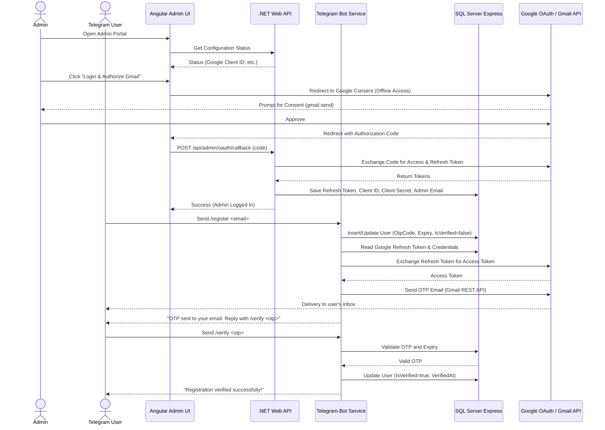

# Implementation Plan - RemoteAssistant (Part 1: Telegram Integration with Angular Admin UI & Google OAuth)

This document outlines the architecture, database schema, and integration flows for the refined **Option B** design. 

## Goal Description
Build a multi-project .NET 10 & Angular 18 solution supporting:
- **Telegram Chatbot** (Worker Service) for user registration and OTP verification.
- **Admin Portal** (Angular UI) for Google OAuth 2.0 authentication and configuration.
- **Backend API** (Web API) for database interactions, Google OAuth token exchange, and configuration management.
- **SQL Server Express** to store registered users and system configurations (tokens, API keys).
- **Google Gmail API** to send OTP emails securely using the Admin's OAuth Refresh Token.

---

## 🏗️ System Architecture



---

## 🗄️ Database Schema (User Registration & System Settings)

We will use EF Core Code-First to manage the schema. The database will contain two main tables.

### 1. `Users` Table
Stores user registration details and verification status.

| Column Name | Data Type | Nullability | Description |
| :--- | :--- | :--- | :--- |
| `TelegramId` | `bigint` | **NOT NULL** (PK) | Unique Telegram user identifier. |
| `Email` | `nvarchar(255)` | **NOT NULL** | The email address provided during registration. |
| `IsVerified` | `bit` | **NOT NULL** | Defaults to `0` (false). Set to `1` (true) upon verification. |
| `OtpCode` | `nvarchar(10)` | *NULL* | The currently active 6-digit OTP code. |
| `OtpExpiry` | `datetime2` | *NULL* | Expiration timestamp of the OTP (created + 5 minutes). |
| `CreatedAt` | `datetime2` | **NOT NULL** | Timestamp when registration was initiated. |
| `VerifiedAt` | `datetime2` | *NULL* | Timestamp when verification succeeded. |

### 2. `SystemSettings` Table
Key-value store for application settings (Telegram token, Google OAuth client credentials, and the admin refresh token).

| Column Name | Data Type | Nullability | Description |
| :--- | :--- | :--- | :--- |
| `Key` | `nvarchar(100)` | **NOT NULL** (PK) | Setting key (e.g., `GoogleClientId`, `GoogleRefreshToken`). |
| `Value` | `nvarchar(max)` | *NULL* | Encrypted or plain text setting value. |
| `UpdatedAt` | `datetime2` | **NOT NULL** | Timestamp of the last configuration update. |

---

## 📁 Project Structure

We will create a multi-project solution structure:

```
RemoteAssistant/
├── RemoteAssistant.sln
├── readme.md
├── RemoteAssistant.Core/                    # Shared Models, DbContext, and Interfaces
│   ├── RemoteAssistant.Core.csproj
│   ├── Database/
│   │   ├── SchedulerDbContext.cs
│   │   ├── User.cs
│   │   └── SystemSetting.cs
│   └── Services/
│       └── ISettingsService.cs              # Read/Write settings helper
├── RemoteAssistant.WebApi/                  # .NET 10 API for Admin UI
│   ├── RemoteAssistant.WebApi.csproj
│   ├── Program.cs
│   ├── appsettings.json
│   ├── Controllers/
│   │   ├── AdminController.cs               # Registration list & OAuth config endpoints
│   │   └── SystemController.cs              # System status check
│   └── DTOs/
│       └── OAuthCallbackDto.cs
├── RemoteAssistant.Worker/                  # .NET 10 Background Worker
│   ├── RemoteAssistant.Worker.csproj
│   ├── Program.cs
│   ├── appsettings.json
│   └── Services/
│       ├── TelegramBotService.cs            # Bot interaction handler
│       └── GmailSenderService.cs            # Exchanges refresh token and sends mail
└── remote-assistant-admin-ui/               # Angular 18 Single Page Application
    ├── package.json
    ├── angular.json
    └── src/
        ├── index.html
        ├── main.ts
        └── app/
            ├── app.routes.ts
            ├── components/
            │   ├── dashboard/               # Shows registered users list
            │   ├── setup/                   # Google OAuth credentials & Telegram setup
            │   └── oauth-callback/          # Handles redirect from Google OAuth
            └── services/
                └── api.service.ts           # Interacts with WebApi
```

---

## 🔐 Google OAuth & Gmail Integration Details

### OAuth Configuration
The Admin will create a Google Cloud Project with the following parameters:
- **Application Type:** Web Application
- **Authorized Redirect URIs:** `http://localhost:4200/oauth-callback`
- **Scopes required:**
  - `openid` (ID Token / email verification)
  - `https://www.googleapis.com/auth/gmail.send` (Permission to send emails)

### Gmail REST API Sending
Instead of heavy SMTP packages, we will send emails via Google's Gmail API:
1. Request access token:
   `POST https://oauth2.googleapis.com/token`
   with `client_id`, `client_secret`, `refresh_token`, and `grant_type=refresh_token`.
2. Post base64url encoded MIME email to:
   `POST https://gmail.googleapis.com/v1/users/me/messages/send`
   header: `Authorization: Bearer <access_token>`

---

## 🚦 Verification Plan

### Automated Checks
Ensure compilation of backend projects:
- `dotnet build`

### Manual Verification
1. **Google OAuth Authorization:**
   - Run the Web API and Angular app.
   - Enter Google Client ID and Client Secret on the setup page.
   - Click "Authorize Gmail" → Authorize via Google Account.
   - Verify that the Redirect URL exchanges the code, and `GoogleRefreshToken` and `GoogleAdminEmail` are saved to the `SystemSettings` database table.
2. **Bot Registration & OTP Email Flow:**
   - Configure a Telegram Bot Token in the settings.
   - Start the Worker Service.
   - Send `/register user@example.com` to the Telegram Bot.
   - Check the `Users` database table to confirm a row is created with `IsVerified = 0` and an `OtpCode` is generated.
   - Confirm a real email containing the OTP code arrives in `user@example.com`'s inbox.
   - Send `/verify <otp>` to the Telegram Bot.
   - Confirm the bot replies with success and the database row updates to `IsVerified = 1`.
