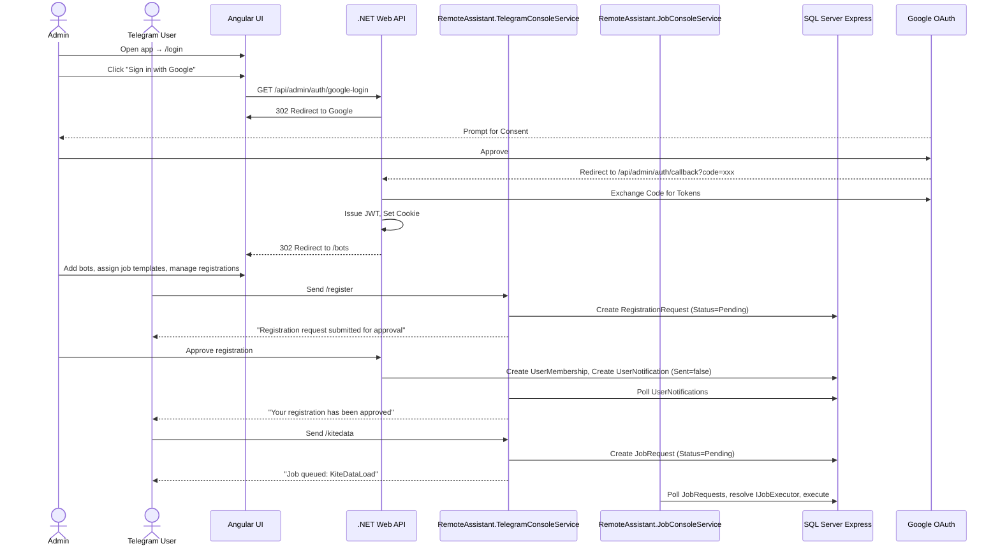

# Remote Assistant

A multi-project .NET 10 and Angular 18 application with Google OAuth login and Telegram bot management. Users register to individual bots via Telegram to trigger automated jobs.

---

## Architecture



---

## Solution Structure

| Project | Type | Description |
|---------|------|-------------|
| `RemoteAssistant.Core` | Class Library | Shared entities and EF Core DbContext |
| `RemoteAssistant.AdminApi` | ASP.NET Core Web API | REST API: OAuth, bot CRUD, registration management, job templates |
| `RemoteAssistant.TelegramConsoleService` | .NET Worker Service | Telegram bot polling, commands, notification delivery |
| `RemoteAssistant.JobConsoleService` | .NET Worker Service | Polls `JobRequests` table, executes jobs via `IJobExecutor` |
| `remote-assistant-admin-ui` | Angular 18 SPA | Glassmorphic dark-themed web UI |

---

## Frontend Routes

| Path | Component | Auth | Description |
|------|-----------|------|-------------|
| `/login` | LoginComponent | No | Google sign-in + first-run credential setup |
| `/bots` | SetupComponent | AuthGuard | Bot management, registrations, approvals, job assignments |
| `/` | redirect | — | Redirects to `/bots` |

---

## Database Schema

### TelegramBots

| Column | Type | Nullable | Description |
|--------|------|----------|-------------|
| `Id` | `int` (PK) | NOT NULL | Auto-increment |
| `Name` | `nvarchar(100)` | NOT NULL | Display name |
| `Description` | `nvarchar(500)` | NULL | Optional description |
| `Token` | `nvarchar(500)` | NOT NULL | Bot token from @BotFather |
| `CreatedAt` | `datetime2` | NOT NULL | |
| `UpdatedAt` | `datetime2` | NOT NULL | |

### UserMemberships

| Column | Type | Nullable | Description |
|--------|------|----------|-------------|
| `Id` | `int` (PK) | NOT NULL | Auto-increment |
| `TelegramId` | `bigint` | NOT NULL | Telegram user ID |
| `TelegramBotId` | `int` (FK) | NOT NULL | Which bot |
| `RegisteredAt` | `datetime2` | NOT NULL | |

> Unique constraint on `(TelegramId, TelegramBotId)` — same user can be member of multiple bots.

### RegistrationRequests

| Column | Type | Nullable | Description |
|--------|------|----------|-------------|
| `Id` | `int` (PK) | NOT NULL | Auto-increment |
| `TelegramId` | `bigint` | NOT NULL | Telegram user ID |
| `TelegramBotId` | `int` (FK) | NOT NULL | Which bot |
| `Status` | `nvarchar(50)` | NOT NULL | `Pending`, `Approved`, `Rejected` |
| `RequestedAt` | `datetime2` | NOT NULL | |
| `ReviewedAt` | `datetime2` | NULL | |
| `ReviewedBy` | `nvarchar(100)` | NULL | Admin who reviewed |

> Registration approval queue — human-in-the-loop.

### JobTemplates

| Column | Type | Nullable | Description |
|--------|------|----------|-------------|
| `Id` | `int` (PK) | NOT NULL | Auto-increment |
| `JobType` | `nvarchar(100)` | NOT NULL | Maps to `IJobExecutor.JobType` |
| `Name` | `nvarchar(200)` | NOT NULL | Human-readable name |
| `Description` | `nvarchar(500)` | NULL | |
| `CreatedAt` | `datetime2` | NOT NULL | |
| `UpdatedAt` | `datetime2` | NOT NULL | |

> Seeded with `KiteDataLoad` on first run. Standalone definition — no direct link to bots.

### JobBotMappings

| Column | Type | Nullable | Description |
|--------|------|----------|-------------|
| `TelegramBotId` | `int` (FK PK) | NOT NULL | Which bot |
| `JobTemplateId` | `int` (FK PK) | NOT NULL | Which job template |

> Many-to-many mapping between bots and job templates.

### JobRequests

| Column | Type | Nullable | Description |
|--------|------|----------|-------------|
| `Id` | `int` (PK) | NOT NULL | Auto-increment |
| `TelegramBotId` | `int` (FK) | NOT NULL | Which bot received the command |
| `JobType` | `nvarchar(100)` | NOT NULL | e.g. `KiteDataLoad` |
| `TelegramId` | `bigint` | NOT NULL | Who triggered it |
| `Parameters` | `nvarchar(2000)` | NULL | |
| `Status` | `nvarchar(50)` | NOT NULL | `Pending`, `Completed`, `Failed` |
| `CreatedAt` | `datetime2` | NOT NULL | |
| `CompletedAt` | `datetime2` | NULL | |
| `Result` | `nvarchar(4000)` | NULL | Job output |

### UserNotifications

| Column | Type | Nullable | Description |
|--------|------|----------|-------------|
| `Id` | `int` (PK) | NOT NULL | Auto-increment |
| `TelegramBotId` | `int` (FK) | NOT NULL | Which bot delivers the message |
| `TelegramId` | `bigint` | NOT NULL | Recipient |
| `Message` | `nvarchar(2000)` | NOT NULL | Notification text |
| `Sent` | `bit` | NOT NULL | `0` = queued, `1` = delivered |
| `CreatedAt` | `datetime2` | NOT NULL | |
| `SentAt` | `datetime2` | NULL | |

> TelegramBotService polls every 15s for unsent messages.

### OAuthProviders

| Column | Type | Nullable | Description |
|--------|------|----------|-------------|
| `Provider` | `nvarchar(50)` (PK) | NOT NULL | e.g. `Google` |
| `ClientId` | `nvarchar(500)` | NULL | |
| `ClientSecret` | `nvarchar(500)` | NULL | |
| `UpdatedAt` | `datetime2` | NOT NULL | |

> Multi-provider ready. Falls back to `appsettings.json` if no DB row.

### SystemSettings

| Column | Type | Nullable | Description |
|--------|------|----------|-------------|
| `Key` | `nvarchar(100)` (PK) | NOT NULL | |
| `Value` | `nvarchar(max)` | NULL | |
| `UpdatedAt` | `datetime2` | NOT NULL | |

> Stores `GoogleRefreshToken`, `GoogleAdminEmail`, and legacy `TelegramBotToken`.

---

## Prerequisites

- **.NET 10 SDK**
- **Node.js** v18+ & npm
- **SQL Server Express** (local)
- **Google Cloud Console** project with OAuth 2.0 credentials

---

## Google Cloud Console Setup

1. Go to the [Google Cloud Console](https://console.cloud.google.com/)
2. Create a project → **APIs & Services > Credentials**
3. Configure the **OAuth Consent Screen** (External) with scopes: `openid`, `email`, `profile`
4. Create **OAuth Client ID** → Web Application
5. Under **Authorized redirect URIs**, add:
   ```
   http://localhost:5000/api/admin/auth/callback
   ```
6. Save to get your **Client ID** and **Client Secret**

---

## Telegram Bot Setup

1. Open Telegram → search **@BotFather**
2. Send `/newbot` and follow prompts
3. Save the HTTP API **Bot Token**

---

## Running the Application

### 1. Start the Web API (must be first)
```bash
dotnet run --project RemoteAssistant.AdminApi
```
Starts on `http://localhost:5000`. Creates database and all tables on startup. **Start this first** — other services depend on the schema it creates.

> **Note:** On every startup, all tables are dropped and recreated. This is intentional for development — the database is always clean.

### 2. Start the Telegram Console Service
```bash
dotnet run --project RemoteAssistant.TelegramConsoleService
```
Polls the latest bot from `TelegramBots` every 15s. Delivers `UserNotifications`.

### 3. Start the Job Management Console Service
```bash
dotnet run --project RemoteAssistant.JobConsoleService
```
Polls `JobRequests` every 10s, resolves `IJobExecutor` by `JobType`, executes pending jobs.

### 4. Start the Angular UI
```bash
cd remote-assistant-admin-ui
npm install
npm run start
```
Starts on `http://localhost:4200`.

---

## Configuration Workflow

> **First run**: Configure your Google Client ID and Client Secret in `appsettings.json` (under the `"Google"` section) or via the login page form. Without these, OAuth will not work.

1. Open **`http://localhost:4200`** — lands on the login page
2. If credentials are not configured, enter Client ID + Client Secret and save
3. Click **Sign in with Google** — server redirects to Google for authentication
4. After login, taken to the bots page
5. Click **+ Add Bot**, enter name, optional description, and the Bot Token
6. Click **Jobs** on a bot to assign job templates to it
7. Click any bot to expand registrations and pending approval requests

> Optional: Restrict login to a specific Google account via `"Admin:AllowedEmail"` in `appsettings.json`.

---

## Authentication

Google OAuth is the single entry point (`openid email profile` scopes).

1. User clicks "Sign in with Google" on `/login`
2. Angular calls `GET /api/admin/auth/google-login` → server 302 to Google
3. User consents → Google redirects to `GET /api/admin/auth/callback?code=xxx`
4. Server exchanges code, saves admin email, issues JWT, sets cookie, redirects to `/bots`
5. Angular `AuthService` reads cookie, stores JWT in localStorage, clears cookie
6. `AuthInterceptor` attaches `Authorization: Bearer` header to API requests
7. `AuthGuard` protects `/bots`, redirects to `/login` if no valid JWT

JWT signing key is auto-generated if not configured. Set `Jwt:Key` in `appsettings.json` for persistent sessions.

---

## Telegram Bot Commands

Each bot is an independent domain — users register to each bot separately.

| Command | Access | Description |
|---------|--------|-------------|
| `/start` | Anyone | Welcome message with bot name and available commands |
| `/help` | Anyone | Same as `/start` |
| `/register` | Anyone | Submits a `RegistrationRequest` for admin approval |
| `/unregister` | Registered | Removes the `UserMembership` |
| `/status` | Anyone | Shows registration state |
| `/jobs` | Registered | Lists job commands assigned via `JobBotMappings` |
| `/kitedata` | Registered + assigned | Creates a `JobRequest` of type `KiteDataLoad` |

### Status Responses

| State | `/status` Response |
|-------|-------------------|
| Active membership | *"Status: Registered since DATE."* |
| Pending approval | *"Status: Pending approval (requested DATE)."* |
| Rejected | *"Status: Registration was rejected on DATE. Send /register to submit a new request."* |
| Not registered | *"Status: Not registered. Send /register to request access."* |

---

## Registration Approval Flow

1. Telegram user sends `/register` → `RegistrationRequests` row with `Status = "Pending"`
2. Admin sees the request in the UI under the bot's expanded view
3. Admin clicks **Approve** or **Reject**
4. A `UserNotifications` row is queued
5. TelegramBotService delivers the notification via Telegram

### Admin Actions

| Action | Effect | Notification |
|--------|--------|-------------|
| Approve | Creates `UserMembership` | Yes |
| Reject | Marks request as `Rejected` | Yes |
| Re-approve | Re-creates `UserMembership` | Yes |
| Unregister | Removes `UserMembership` | Yes |

---

## Job System

Jobs are **preconfigured** in the `JobTemplates` table (seeded with `KiteDataLoad`). Each template maps to an `IJobExecutor` implementation in C#.

```csharp
public interface IJobExecutor
{
    string JobType { get; }
    Task<string> ExecuteAsync(JobRequest job, CancellationToken ct);
}
```

**KiteDataLoadJob** generates mock OHLC candle data. Register new executors in `RemoteAssistant.JobConsoleService/Program.cs`:
```csharp
builder.Services.AddSingleton<IJobExecutor, YourJobExecutor>();
```

### Assigning Jobs to Bots

In the UI, click **Jobs** on any bot to open the assignment panel. Check which job templates the bot should offer. Registered users of that bot can then trigger those jobs via the corresponding command.

---

## API Endpoints

| Method | Endpoint | Auth | Description |
|--------|----------|------|-------------|
| `GET` | `/api/admin/auth/google-login` | No | 302 redirect to Google OAuth |
| `GET` | `/api/admin/auth/callback` | No | Google OAuth callback — exchanges code, issues JWT |
| `GET` | `/api/admin/auth/status` | Yes | Current user email |
| `POST` | `/api/admin/auth/logout` | No | Logout acknowledgment |
| `GET` | `/api/admin/config` | No | Config status |
| `POST` | `/api/admin/config/telegram` | Yes | Save bot token to SystemSettings |
| `POST` | `/api/admin/config/google` | No | Save Google credentials to OAuthProviders |
| `GET` | `/api/admin/bots` | Yes | List all bots |
| `POST` | `/api/admin/bots` | Yes | Create bot |
| `PUT` | `/api/admin/bots/{id}` | Yes | Update bot |
| `DELETE` | `/api/admin/bots/{id}` | Yes | Delete bot |
| `GET` | `/api/admin/bots/{id}/registrations` | Yes | List `UserMemberships` |
| `GET` | `/api/admin/bots/{id}/pending` | Yes | List `RegistrationRequests` |
| `POST` | `/api/admin/bots/{botId}/pending/{id}/approve` | Yes | Approve request |
| `POST` | `/api/admin/bots/{botId}/pending/{id}/reject` | Yes | Reject request |
| `POST` | `/api/admin/bots/{botId}/pending/{id}/reapprove` | Yes | Re-approve rejected |
| `POST` | `/api/admin/bots/{botId}/registrations/{id}/unregister` | Yes | Remove membership |
| `GET` | `/api/admin/job-types` | Yes | List job templates |
| `GET` | `/api/admin/bots/{botId}/jobs` | Yes | Get assigned job template IDs |
| `PUT` | `/api/admin/bots/{botId}/jobs` | Yes | Set job template assignments |

---

## Environment Files

`src/environments/environment.ts` — template (tracked in git):
```ts
export const environment = {
  production: true,
  apiBaseUrl: 'http://localhost:5000/api/admin'
};
```

`src/environments/environment.development.ts` — development (gitignored).

---

## Configuration Keys (appsettings.json)

```jsonc
{
  "Google": {
    "ClientId": "",             // Google OAuth Client ID
    "ClientSecret": ""          // Google OAuth Client Secret
  },
  "Frontend": {
    "BaseUrl": "http://localhost:4200"
  },
  "Admin": {
    "AllowedEmail": ""          // Optional: restrict login to one email
  },
  "Jwt": {
    "Key": "",                  // Min 32 chars, auto-generated if missing
    "Issuer": "RemoteAssistant",
    "Audience": "RemoteAssistant-AdminUI"
  },
  "ConnectionStrings": {
    "DefaultConnection": "Server=localhost\\SQLEXPRESS;Database=SchedulerTelegramDb;Trusted_Connection=True;TrustServerCertificate=True;"
  }
}
```

> Google credentials can be in `appsettings.json` (fallback) or saved via the login page UI to the `OAuthProviders` table. DB is checked first.
