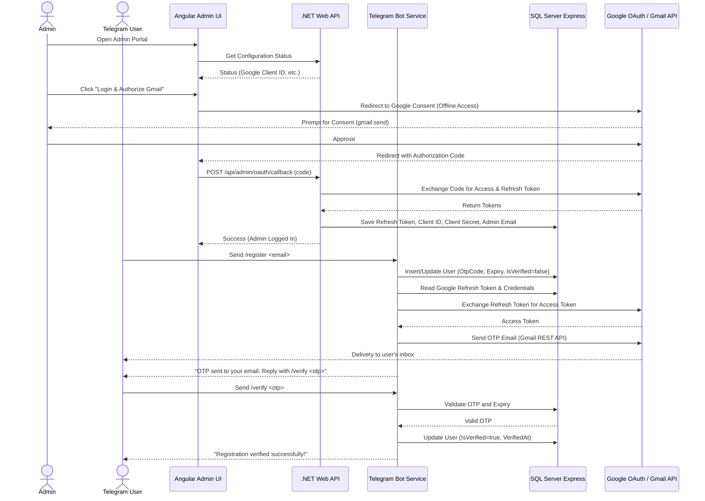

# RemoteAssistant - Part 1: Telegram Integration

Welcome to **RemoteAssistant**, a multi-project .NET 10 and Angular 18 application designed for job scheduling and remote system assistance. This represents **Part 1**, implementing user registration flow with email OTP authentication, a SQL Server Express database backend, and a Google OAuth-authorized Gmail sender.

---

## 🏗️ Architecture



---

## 📁 Solution Structure

- **`RemoteAssistant.Core`**: Shared models and EF Core DbContext.
- **`RemoteAssistant.WebApi`**: Core REST API endpoints for admin setup and dashboard users listing.
- **`RemoteAssistant.Worker`**: Background Worker Service running the Telegram Bot client and handling Gmail REST API integration.
- **`remote-assistant-admin-ui`**: A high-fidelity, glassmorphic dark-themed Angular 18 SPA.

---

## 🗄️ Database Schema

The database initializes automatically on startup using Code-First `context.Database.EnsureCreated()`.

### 1. `Users` Table
| Column Name | Data Type | Nullability | Description |
| :--- | :--- | :--- | :--- |
| `TelegramId` | `bigint` | **NOT NULL** (PK) | Unique Telegram user identifier. |
| `Email` | `nvarchar(255)` | **NOT NULL** | The email address provided during registration. |
| `IsVerified` | `bit` | **NOT NULL** | Verification status (`0` = Pending, `1` = Verified). |
| `OtpCode` | `nvarchar(10)` | *NULL* | Active 6-digit OTP code. |
| `OtpExpiry` | `datetime2` | *NULL* | OTP expiration timestamp (created + 5 minutes). |
| `CreatedAt` | `datetime2` | **NOT NULL** | Timestamp when registration was initiated. |
| `VerifiedAt` | `datetime2` | *NULL* | Timestamp when verification succeeded. |

### 2. `SystemSettings` Table
| Column Name | Data Type | Nullability | Description |
| :--- | :--- | :--- | :--- |
| `Key` | `nvarchar(100)` | **NOT NULL** (PK) | Configuration setting key (e.g. `GoogleClientId`). |
| `Value` | `nvarchar(max)` | *NULL* | Configuration value. |
| `UpdatedAt` | `datetime2` | **NOT NULL** | Last modification timestamp. |

---

## ⚙️ Configuration Setup

### 1. Google OAuth 2.0 Credentials
To configure the Gmail sending API, you will need a Google Developer Project:
1. Go to the **[Google Cloud Console](https://console.cloud.google.com/)**.
2. Create a project and navigate to **APIs & Services > Credentials**.
3. Configure the **OAuth Consent Screen** (User Type: External) and add the scope `https://www.googleapis.com/auth/gmail.send`.
4. Under **Credentials**, click **Create Credentials > OAuth Client ID**.
5. Select **Web Application** as application type.
6. Under **Authorized redirect URIs**, add `http://localhost:4200/oauth-callback`.
7. Save to get your **Client ID** and **Client Secret**.

### 2. Telegram Bot Token
1. Open Telegram and search for the **@BotFather** bot.
2. Send `/newbot` and follow the prompts to name your bot and choose a username.
3. Save the HTTP API **Bot Token** returned by BotFather.

---

## 🚀 Running the Application

### Prerequisites
- **.NET 10 SDK**
- **Node.js** (v18+) & **npm**
- **SQL Server Express** running locally. (The application defaults to Local Windows Authentication: `Server=localhost\SQLEXPRESS;Database=SchedulerTelegramDb;Trusted_Connection=True;TrustServerCertificate=True;`).

### Step 1: Start the Web API
From the repository root:
```bash
dotnet run --project RemoteAssistant.WebApi
```
*Note: On first startup, the Web API creates the database schema automatically in SQL Server Express.*

### Step 2: Start the Worker Service
```bash
dotnet run --project RemoteAssistant.Worker
```
*Note: The background worker will wait and state that the Telegram Token is missing until you complete the Admin UI configuration.*

### Step 3: Run the Angular Admin Portal
```bash
cd remote-assistant-admin-ui
npm install
npm run start
```
1. Open your browser and navigate to **`http://localhost:4200`**.
2. Click **⚙ Settings Panel** in the top right.
3. Input your **Telegram Bot Token** and click **Save Bot Token**.
4. Input your Google OAuth **Client ID** and **Client Secret** and click **Save Google Credentials**.
5. Click **🔑 Authorize Gmail Account** to log in and consent via Google. 
6. You will be redirected back, and the Gmail service will show active status!

---

## 🚦 Verification Flow

1. open Telegram and find your bot.
2. Send `/start` to see the registration instructions.
3. Send `/register your-email@example.com` (using a real email address you have access to).
4. Check your inbox for a message titled `RemoteAssistant Registration OTP` sent from the admin's Gmail.
5. In Telegram, reply with `/verify 123456` (replacing with the OTP from the email).
6. The bot will respond with success.
7. Open the Angular Admin UI on `http://localhost:4200/dashboard` and verify the user is now listed in the database as **Verified**!
