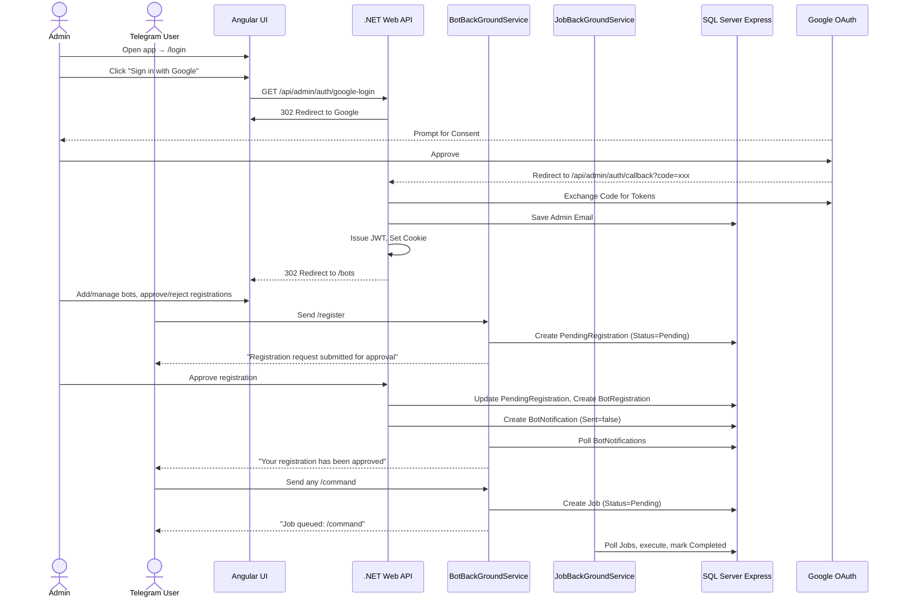

# Remote Assistant

A multi-project .NET 10 and Angular 18 application with Google OAuth login and Telegram bot management. Users register to individual bots via Telegram to trigger automated jobs.

---

## Architecture



---

## Solution Structure

| Project | Type | Description |
|---------|------|-------------|
| `RemoteAssistant.Core` | Class Library | Shared entities and EF Core DbContext |
| `RemoteAssistant.WebApi` | ASP.NET Core Web API | REST API: OAuth, bot CRUD, registration management, notifications |
| `BotBackGroundService` | .NET Worker Service | Telegram bot polling, per-bot commands (`/register`, `/unregister`, `/status`), notification delivery |
| `JobBackGroundService` | .NET Worker Service | Polls the `Jobs` table and executes pending jobs |
| `remote-assistant-admin-ui` | Angular 18 SPA | Glassmorphic dark-themed web UI |

---

## Frontend Routes

| Path | Auth | Description |
|------|------|-------------|
| `/login` | No | Google sign-in page, first-run credential setup |
| `/bots` | Yes | Main page: bot list, add/edit/delete, manage registrations |
| `/` | — | Redirects to `/bots` (or `/login` if unauthenticated) |

---

## Database Schema

### TelegramBots

| Column | Type | Nullable | Description |
|--------|------|----------|-------------|
| `Id` | `int` | NOT NULL (PK) | Auto-increment |
| `Name` | `nvarchar(100)` | NOT NULL | Display name (shown to users) |
| `Description` | `nvarchar(500)` | NULL | Optional description |
| `Token` | `nvarchar(500)` | NOT NULL | Bot token from @BotFather |
| `IsActive` | `bit` | NOT NULL | Whether the bot service polls this bot |
| `CreatedAt` | `datetime2` | NOT NULL | |
| `UpdatedAt` | `datetime2` | NOT NULL | |

### BotRegistrations

| Column | Type | Nullable | Description |
|--------|------|----------|-------------|
| `Id` | `int` | NOT NULL (PK) | Auto-increment |
| `TelegramId` | `bigint` | NOT NULL | Telegram user ID |
| `BotId` | `int` | NOT NULL (FK) | Which bot they're registered to |
| `IsActive` | `bit` | NOT NULL | Active or unregistered |
| `RegisteredAt` | `datetime2` | NOT NULL | |
| `UnregisteredAt` | `datetime2` | NULL | When they unregistered |

> Unique constraint on `(TelegramId, BotId)` — same Telegram user can register to multiple bots independently.

### PendingRegistrations

| Column | Type | Nullable | Description |
|--------|------|----------|-------------|
| `Id` | `int` | NOT NULL (PK) | Auto-increment |
| `TelegramId` | `bigint` | NOT NULL | Telegram user ID |
| `BotId` | `int` | NOT NULL (FK) | Which bot |
| `Status` | `nvarchar(50)` | NOT NULL | `Pending`, `Approved`, or `Rejected` |
| `RequestedAt` | `datetime2` | NOT NULL | |
| `ReviewedAt` | `datetime2` | NULL | |
| `ReviewedBy` | `nvarchar(100)` | NULL | Email of admin who reviewed |

> Registration approval queue — human-in-the-loop prevents fake accounts.

### Jobs

| Column | Type | Nullable | Description |
|--------|------|----------|-------------|
| `Id` | `int` | NOT NULL (PK) | Auto-increment |
| `BotId` | `int` | NOT NULL (FK) | Which bot triggered the job |
| `TelegramId` | `bigint` | NOT NULL | User who triggered it |
| `Command` | `nvarchar(100)` | NOT NULL | The `/command` that was issued |
| `Payload` | `nvarchar(2000)` | NULL | Arguments passed with the command |
| `Status` | `nvarchar(50)` | NOT NULL | `Pending`, `Completed`, `Failed` |
| `CreatedAt` | `datetime2` | NOT NULL | |
| `CompletedAt` | `datetime2` | NULL | |
| `Result` | `nvarchar(2000)` | NULL | Job output |

### BotNotifications

| Column | Type | Nullable | Description |
|--------|------|----------|-------------|
| `Id` | `int` | NOT NULL (PK) | Auto-increment |
| `BotId` | `int` | NOT NULL (FK) | Which bot delivers the message |
| `TelegramId` | `bigint` | NOT NULL | Recipient |
| `Message` | `nvarchar(2000)` | NOT NULL | Notification text |
| `Sent` | `bit` | NOT NULL | `0` = queued, `1` = delivered |
| `CreatedAt` | `datetime2` | NOT NULL | |
| `SentAt` | `datetime2` | NULL | |

> BotBackGroundService polls this table every 15s and delivers unsent messages.

### OAuthProviders

| Column | Type | Nullable | Description |
|--------|------|----------|-------------|
| `Provider` | `nvarchar(50)` | NOT NULL (PK) | Provider name (e.g. `Google`) |
| `ClientId` | `nvarchar(500)` | NULL | OAuth Client ID |
| `ClientSecret` | `nvarchar(500)` | NULL | OAuth Client Secret |
| `UpdatedAt` | `datetime2` | NOT NULL | |

> Multi-provider ready — add rows for GitHub, Microsoft, etc.

### SystemSettings

| Column | Type | Nullable | Description |
|--------|------|----------|-------------|
| `Key` | `nvarchar(100)` | NOT NULL (PK) | Setting key |
| `Value` | `nvarchar(max)` | NULL | Setting value |
| `UpdatedAt` | `datetime2` | NOT NULL | |

> Stores `GoogleRefreshToken` and `GoogleAdminEmail` from the OAuth flow.

---

## Prerequisites

- **.NET 10 SDK**
- **Node.js** v18+ & npm
- **SQL Server Express** (local)
- **Google Cloud Console** project with OAuth 2.0 credentials

---

## Google Cloud Console Setup

1. Go to the [Google Cloud Console](https://console.cloud.google.com/)
2. Create a project → **APIs & Services > Credentials**
3. Configure the **OAuth Consent Screen** (External) with scopes: `openid`, `email`, `profile`
4. Create **OAuth Client ID** → Web Application
5. Under **Authorized redirect URIs**, add:
   ```
   http://localhost:5000/api/admin/auth/callback
   ```
6. Save to get your **Client ID** and **Client Secret**

---

## Telegram Bot Setup

1. Open Telegram → search **@BotFather**
2. Send `/newbot` and follow prompts
3. Save the HTTP API **Bot Token**

---

## Running the Application

### 1. Start the Web API
```bash
dotnet run --project RemoteAssistant.WebApi
```
Starts on `http://localhost:5000`. Creates/verifies database tables on first startup.

### 2. Start the Bot Background Service
```bash
dotnet run --project BotBackGroundService
```
Polls the first active bot from `TelegramBots` every 15 seconds. Delivers notifications.

### 3. Start the Job Background Service
```bash
dotnet run --project JobBackGroundService
```
Polls the `Jobs` table every 10 seconds and executes pending jobs.

### 4. Start the Angular UI
```bash
cd remote-assistant-admin-ui
npm install
npm run start
```
Starts on `http://localhost:4200`.

---

## Configuration Workflow

> **First run**: Configure your Google Client ID and Client Secret in `appsettings.json` (under the `"Google"` section) or via the login page form. Without these, OAuth will not work.

1. Open **`http://localhost:4200`** — you'll land on the **login page**
2. If credentials are not yet configured, enter your **Client ID** and **Client Secret** and click **Save Credentials**
3. Click **Sign in with Google** — the server redirects to Google for authentication
4. After login, you're taken to the **bots page**
5. Click **+ Add Bot**, enter a **name**, optional **description**, and the **Bot Token** from @BotFather
6. Click any bot to expand its registrations and pending requests

> Optional: Restrict login to a specific Google account by setting `"Admin:AllowedEmail": "admin@example.com"` in `appsettings.json`.

---

## Authentication

Google OAuth is the single entry point. Sign-in requests `openid email profile` scopes.

**Flow:**
1. User clicks "Sign in with Google" on `/login`
2. Angular calls `GET /api/admin/auth/google-login`
3. Server responds with 302 redirect to Google
4. User consents — Google redirects to `GET /api/admin/auth/callback?code=xxx`
5. Server exchanges code for tokens, saves admin email to DB
6. Server issues a JWT, sets it as a non-httpOnly cookie (`auth_token`) and redirects to `/bots`
7. Angular `AuthService` reads cookie on init, stores JWT in `localStorage`, clears cookie
8. `AuthInterceptor` attaches JWT as `Authorization: Bearer` header on all API requests
9. `AuthGuard` protects the `/bots` route, redirecting to `/login` if no valid JWT

**First-run setup:** If credentials aren't configured, the login page shows a form to enter Client ID and Client Secret. These are saved to the `OAuthProviders` database table via `POST /api/admin/config/google` (anonymous). Falls back to `appsettings.json` if DB has no matching row.

**JWT signing key:** Auto-generated if `Jwt:Key` is not in config. Set it permanently for persistent sessions across restarts.

---

## Telegram Bot Commands

Each bot is an independent domain — users register to each bot separately. The bot uses its `Name` from the database in welcome messages.

| Command | Access | Description |
|---------|--------|-------------|
| `/start` | Anyone | Welcome message showing bot name and available commands |
| `/help` | Anyone | Same as `/start` |
| `/register` | Anyone | Submits a registration request for admin approval |
| `/unregister` | Registered | Self-service unregister from the bot |
| `/status` | Anyone | Shows current state: registered, pending approval, rejected, or unregistered |
| Any `/command` | Registered | Creates a `Job` record and replies "Job queued" |

### Registration Approval Flow

1. Telegram user sends `/register` → a `PendingRegistrations` row is created with `Status = "Pending"`
2. Admin sees the request in the web UI under the bot's expanded view
3. Admin clicks **Approve** or **Reject**
4. A `BotNotifications` row is queued with the result
5. BotBackGroundService delivers the notification to the user via Telegram
6. Approved users can issue job commands; rejected users must `/register` again

### Status Responses

| State | `/status` Response |
|-------|-------------------|
| Active registration | *"Status: Registered since DATE."* |
| Pending approval | *"Status: Pending approval (requested DATE)."* |
| Rejected | *"Status: Registration was rejected on DATE. Send /register to submit a new request."* |
| Unregistered | *"Status: Unregistered. Send /register to request access again."* |
| Never registered | *"Status: Not registered. Send /register to request access."* |

### Web UI Admin Actions

| Action | Effect | Notifies User? |
|--------|--------|---------------|
| Approve | Creates `BotRegistrations`, activates user | Yes — "Your registration has been approved." |
| Reject | Marks request as `Rejected` | Yes — "Your registration request has been rejected." |
| Re-approve | Re-activates a previously rejected user | Yes — "Your registration has been re-approved." |
| Unregister | Deactivates an active user | Yes — "You have been unregistered by the administrator." |

---

## Notification System

The Web API and bot service communicate via the `BotNotifications` table — a simple outbox pattern.

1. Admin actions (approve, reject, re-approve, unregister) insert a `BotNotifications` row with `Sent = false`
2. BotBackGroundService polls every 15 seconds for unsent messages matching the active bot
3. Sends each via `TelegramBotClient.SendTextMessageAsync`
4. Marks as `Sent = true` with timestamp

No direct API call between services — fully decoupled.

---

## API Endpoints

| Method | Endpoint | Auth | Description |
|--------|----------|------|-------------|
| `GET` | `/api/admin/auth/google-login` | No | 302 redirect to Google OAuth |
| `GET` | `/api/admin/auth/callback` | No | Google OAuth callback — exchanges code, issues JWT cookie |
| `GET` | `/api/admin/auth/status` | Yes | Current authenticated user email |
| `POST` | `/api/admin/auth/logout` | No | Logout acknowledgment |
| `GET` | `/api/admin/config` | No | Config status (booleans + active bot count) |
| `POST` | `/api/admin/config/google` | No | Save Google OAuth credentials to DB |
| `GET` | `/api/admin/bots` | Yes | List all Telegram bots |
| `POST` | `/api/admin/bots` | Yes | Create a bot (name, description, token) |
| `PUT` | `/api/admin/bots/{id}` | Yes | Update a bot |
| `PATCH` | `/api/admin/bots/{id}/toggle` | Yes | Enable/disable a bot |
| `DELETE` | `/api/admin/bots/{id}` | Yes | Delete a bot |
| `GET` | `/api/admin/bots/{id}/registrations` | Yes | List registrations for a bot |
| `GET` | `/api/admin/bots/{id}/pending` | Yes | List pending/rejected requests |
| `POST` | `/api/admin/bots/{botId}/pending/{id}/approve` | Yes | Approve a pending request |
| `POST` | `/api/admin/bots/{botId}/pending/{id}/reject` | Yes | Reject a pending request |
| `POST` | `/api/admin/bots/{botId}/pending/{id}/reapprove` | Yes | Re-approve a rejected request |
| `POST` | `/api/admin/bots/{botId}/registrations/{id}/unregister` | Yes | Admin-forced unregister |

---

## Environment Files

`src/environments/environment.ts` — template (tracked in git):
```ts
export const environment = {
  production: true,
  apiBaseUrl: 'http://localhost:5000/api/admin'
};
```

`src/environments/environment.development.ts` — development (gitignored). Copy template and adjust as needed.

---

## Configuration Keys (appsettings.json)

```jsonc
{
  "Google": {
    "ClientId": "",             // Your Google OAuth Client ID
    "ClientSecret": ""          // Your Google OAuth Client Secret
  },
  "Frontend": {
    "BaseUrl": "http://localhost:4200"  // Where to redirect after OAuth
  },
  "Admin": {
    "AllowedEmail": ""          // Optional: restrict login to one email
  },
  "Jwt": {
    "Key": "",                  // Custom signing key (min 32 chars, auto-generated if missing)
    "Issuer": "RemoteAssistant",
    "Audience": "RemoteAssistant-AdminUI"
  },
  "ConnectionStrings": {
    "DefaultConnection": "Server=localhost\\SQLEXPRESS;Database=SchedulerTelegramDb;Trusted_Connection=True;TrustServerCertificate=True;"
  }
}
```

> Google OAuth credentials can be set in `appsettings.json` (fallback) **or** via the login page UI form (saved to the `OAuthProviders` table, keyed by `Provider = "Google"`). The server checks the database first, then falls back to config.
